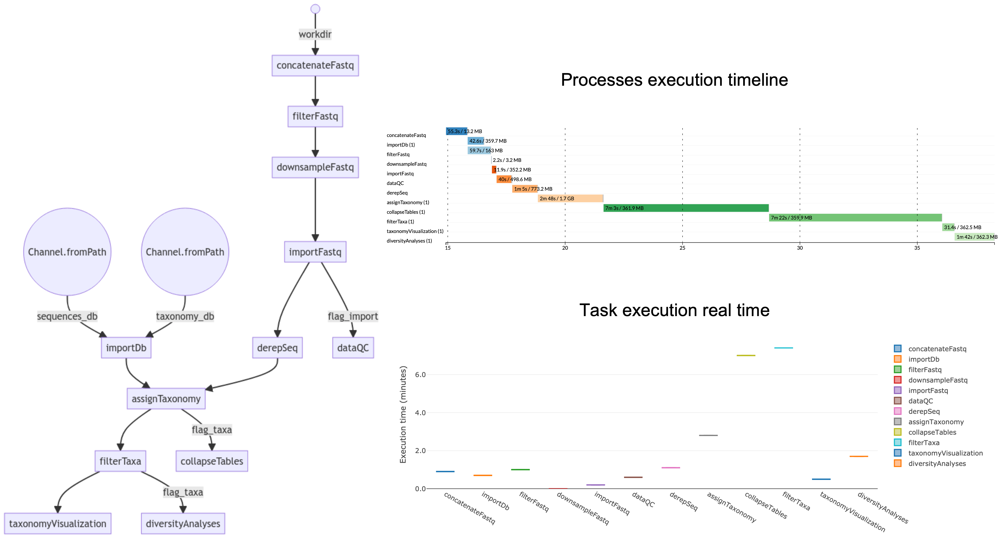
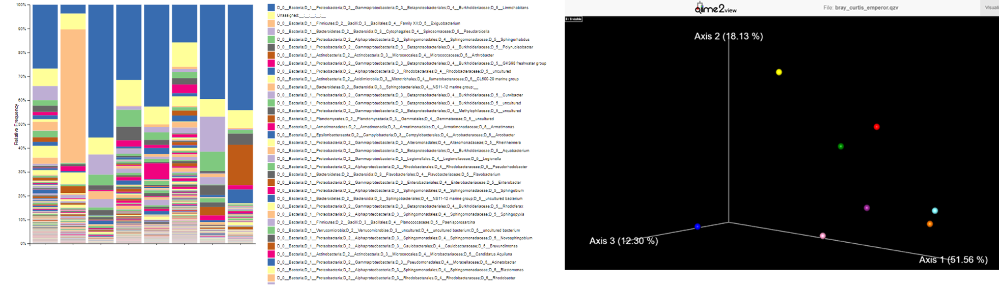
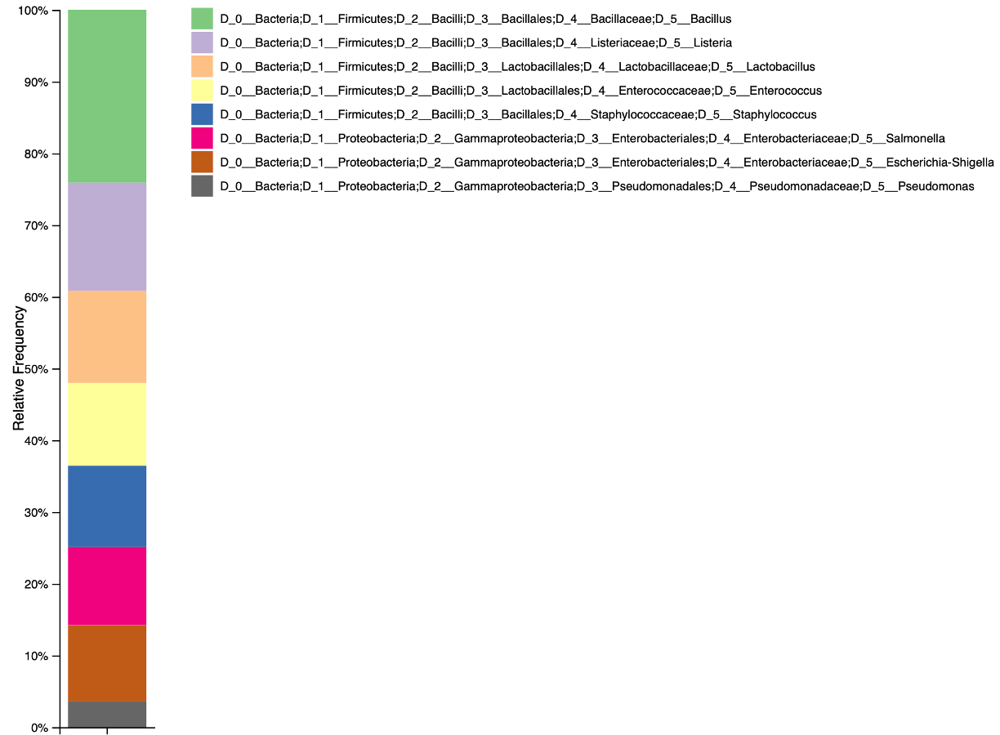

# MetONTIIME

**MetONTIIME** is a Meta-barcoding pipeline for analysing ONT data in QIIME2 framework. Starting from v2.0.0, the pipeline is based on Nextflow, to allow for easier installation and better execution monitoring.

## Getting started

**Prerequisites**

* [Nextflow](https://nf-co.re/usage/installation)
* [Docker](https://docs.docker.com/engine/install/) or [Singularity](https://sylabs.io/guides/3.0/user-guide/installation.html)                                                                                  
                                                                                   
**Installation**

```
git clone https://github.com/MaestSi/MetONTIIME.git
cd MetONTIIME
chmod 755 *
```

## Overview

<p align="center">
  
</p>

## Usage

The MetONTIIME pipeline requires you to open nextflow.config configuration file and set the desired options. Then, you can run the pipeline using either docker or singularity environments just specifying a value for the -profile variable.

```
Usage:
nextflow -c nextflow.config run main.nf --workDir="/path/to/workDir" --resultsDir="/path/to/resultsDir" -profile docker

Mandatory argument:
-profile                                                 Configuration profile to use. Available: docker, singularity
Other mandatory arguments which may be specified in the nextflow.config file

--workDir                                               Path to working directory including fastq.gz files
--sampleMetadata                                        Path to sample metadata tsv file; if it doesn't exist yet, it is created at runtime
--dbSequencesFasta                                      Path to database file with sequences in fasta format
--dbTaxonomyTsv                                         Path to database file with sequence id-to-taxonomy correspondence in tsv format
--dbSequencesQza                                        Database file name with sequences as QIIME2 artifact (qza)
--dbTaxonomyQza                                         Database file name with sequence id-to-taxonomy correspondence as QIIME2 artifact (qza)
--classifier                                            Taxonomy classifier, available: VSEARCH, Blast
--maxNumReads                                           Maximum number of reads per sample; if one sample has more than maxNumReads, random downsampling is performed
--minReadLength                                         Minimum length (bp) for a read to be retained
--maxReadLength                                         Maximum length (bp) for a read to be retained
--minQual                                               Minimum average PHRED score for a read to be retained
--extraEndsTrim                                         Number of bases to be trimmed at both ends
--clusteringIdentity                                    Identity for de novo clustering [0-1]
--maxAccepts                                            Maximum number of candidate hits for each read, to be used for consensus taxonomy assignment
--minConsensus                                          Minimum fraction of assignments must match top hit to be accepted as consensus assignment [0.5-1]
--minQueryCoverage                                      Minimum query coverage for an alignment to be considered a candidate hit [0-1]
--minIdentity                                           Minimum alignment identity for an alignment to be considered a candidate hit [0-1]
--taxaLevelDiversity                                    Taxonomy level at which you want to perform non phylogeny-based diversity analyses
--numReadsDiversity                                     Max num. reads for diversity analyses
--taxaOfInterest                                        Taxa of interest that you want to retain and to focus the analysis on
--minNumReadsTaxaOfInterest                             Minimum number of reads assigned to Taxa of interest to retain a sample
--resultsDir                                            Path to directory containing results
```

## Database

MetONTIIME pipeline allows the users to choose the database according to the marker gene sequenced and to their preferences.
Some [marker gene reference database](https://docs.qiime2.org/2023.9/data-resources/#taxonomy-classifiers-for-use-with-q2-feature-classifier), as [SILVA (16S/18S rRNA)](https://www.arb-silva.de/download/archive/qiime), [GreenGenes (16SrRNA)](http://ftp.microbio.me/greengenes_release/2022.10/) and [UNITE (fungal ITS)](https://doi.plutof.ut.ee/doi/10.15156/BIO/2483915) are already formatted for use with QIIME2, as they are available as a pair of sequences (fasta) and taxonomy (tsv) files, and they can therefore be easily imported as QIIME2 artifacts (qza).
In case you downloaded a fasta file from NCBI and you want to obtain the corresponding taxonomy tsv file, you can use **TaxonomyTsv_from_fastaNCBI.R** script. This R script requires an R installation with [taxize](http://cran.nexr.com/web/packages/taxize/vignettes/taxize_vignette.html) and [Biostrings](https://bioconductor.org/packages/release/bioc/html/Biostrings.html) packages installed.
For example, if you want to use the same database used by the EPI2ME 16S workflow for bacterial 16S gene, you can go to [BioProject 33175](https://www.ncbi.nlm.nih.gov/nuccore?term=33175%5BBioProject%5D), click _send to_, select _Complete Record_ and _File_, set the _Format_ to _FASTA_ and then click _Create File_; the corresponding taxonomyTsv file can then be created with:

```
Rscript /path/to/TaxonomyTsv_from_fastaNCBI.R \
dbSequencesFasta="/path/to/input/dbSequences.fasta" \
dbTaxonomyTsv="./path/to/output//dbTaxonomy.tsv" \
ENTREZ_KEY="myentrezkey"
```

The optional ENTREZ_KEY argument allows speeding up data retrieval from NCBI. You can get your own ENTREZ_KEY following the instructions reported [here](https://ncbiinsights.ncbi.nlm.nih.gov/2017/11/02/new-api-keys-for-the-e-utilities/).

## Output explanation

The pipeline is composed of a set of processes. They can be optionally turned-off by setting them to "false" in the *metontiime2.conf* file.

* importDb: import a fasta file with sequences **dbSequencesFasta** and a tsv file with sequence ids and multi-level taxonomy (with each level separated by ';') **dbTaxonomyTsv** as a pair of QIIME2 artifacts **dbSequencesQza** and **dbTaxonomyQza**.
* concatenateFastq: in case **workDir** is the output directory generated by MinKNOW, this process concatenates all fastq files corresponding to each barcode (in workDir/barcode\<num\>) and compresses them to fastq.gz; if **workDir** already contains fastq.gz files for each barcode, set the process to "false".
* filterFastq: filter fastq.gz files based on length (**minReadLength**, **maxReadLength**) and quality (**minQual**). Moreover, trim **extraEndsTrim** bases from both sides.
* downsampleFastq: cap the amount of sequencing reads for each sample to **maxNumReads**.
* importFastq: import filtered fastq.gz files as QIIME2 artifacts.
* dataQC: evaluate sequencing reads quality/length statistics.
* derepSeq: perform clustering at **clusteringIdentity** identity (in case clusteringIdentity=1 , perform dereplication only), and obtain a set of representative sequences and their abundance.
* assignTaxonomy: assign taxonomy to representative sequences using **classifier** classifier, retrieve up to **maxAccepts** hits filtered by **minIdentity** and **minQueryCoverage**, and perform consensus taxonomy assignment.
* collapseTables: collapse feature tables at the available taxonomy levels.
* filterTaxa: retain only reads from **taxaOfInterest** and discard samples with less than **minNumReadsTaxaOfInterest** assigned to that taxa. In case you do not want to focus the analysis on a specific taxa, set the process to "false".
* taxonomyVisualization: produce barplots describing the relative abundance of all taxa, all taxa excluding "Unclassified" reads, and of **taxaOfInterest** (if any).
* diversityAnalyses: evaluate non-phylogenetic alpha- and beta-diversity indexes at **taxaLevelDiversity** level, either for all taxa or for **taxaOfInterest**, downsampling each sample at **numReadsDiversity** reads. Produce also alpha-rarefaction curves.

## Results visualization

All .qzv and .qza artifacts can be visualized importing them to [QIIME2 View](https://view.qiime2.org/).

In particular, you could visualize an interactive multi-sample taxonomy barplot, describing the composition of each sample at the desired taxonomic level, and a PCA plot of Beta-diversity among samples.

<p align="center">
  
</p>

## Test dataset

A demo dataset composed of 1000 reads named Zymo-GridION-EVEN-BB-SN_sup_pass_filtered_27F_1492Rw_1000_reads.fastq.gz is available. This dataset was obtained re-basecalling with Guppy v 6.2.1 "sup" the [dataset](https://nanopore.s3.climb.ac.uk/Zymo-GridION-EVEN-BB-SN_signal.tar) generated by [LomanLab](https://github.com/LomanLab/mockcommunity) sequencing [Zymo Community Standards 2 (Even) Batch ZRC190633](https://github.com/LomanLab/mockcommunity/blob/master/specs/_d6300_zymobiomics_microbial_community_standard.pdf) mock community with R9.4.1 chemistry on a GridION device. The portion of reads corresponding to 16S gene was then extracted using [in-silico PCR](https://github.com/Nucleomics-VIB/InSilico_PCR) with 27F-1492Rw primers pair.

<p align="center">
  
</p>

## Citations

MetONTIIME is a [Nextflow](http://www.nature.com/nbt/journal/v35/n4/full/nbt.3820.html) pipeline based on [QIIME2](https://qiime2.org/).

If this tool is useful for your work, please consider citing our [manuscript](https://www.mdpi.com/1467-3045/46/5/237).

Matoute, A.; Maestri, S.; Saout, M.; Laghoe, L.; Simon, S.; Blanquart, H.; Hernandez Martinez, M.A.; Pierre Demar, M. Meat-Borne-Parasite: A Nanopore-Based Meta-Barcoding Work-Flow for Parasitic Microbiodiversity Assessment in the Wild Fauna of French Guiana. Curr. Issues Mol. Biol. 2024, 46, 3810-3821. https://doi.org/10.3390/cimb46050237
Please, refer to the following manuscripts for further information.

Bolyen E, Rideout JR, Dillon MR, Bokulich NA, Abnet CC, Al-Ghalith GA, Alexander H, Alm EJ, Arumugam M, Asnicar F, Bai Y, Bisanz JE, Bittinger K, Brejnrod A, Brislawn CJ, Brown CT, Callahan BJ, Caraballo-Rodríguez AM, Chase J, Cope EK, Da Silva R, Diener C, Dorrestein PC, Douglas GM, Durall DM, Duvallet C, Edwardson CF, Ernst M, Estaki M, Fouquier J, Gauglitz JM, Gibbons SM, Gibson DL, Gonzalez A, Gorlick K, Guo J, Hillmann B, Holmes S, Holste H, Huttenhower C, Huttley GA, Janssen S, Jarmusch AK, Jiang L, Kaehler BD, Kang KB, Keefe CR, Keim P, Kelley ST, Knights D, Koester I, Kosciolek T, Kreps J, Langille MGI, Lee J, Ley R, Liu YX, Loftfield E, Lozupone C, Maher M, Marotz C, Martin BD, McDonald D, McIver LJ, Melnik AV, Metcalf JL, Morgan SC, Morton JT, Naimey AT, Navas-Molina JA, Nothias LF, Orchanian SB, Pearson T, Peoples SL, Petras D, Preuss ML, Pruesse E, Rasmussen LB, Rivers A, Robeson MS, Rosenthal P, Segata N, Shaffer M, Shiffer A, Sinha R, Song SJ, Spear JR, Swafford AD, Thompson LR, Torres PJ, Trinh P, Tripathi A, Turnbaugh PJ, Ul-Hasan S, van der Hooft JJJ, Vargas F, Vázquez-Baeza Y, Vogtmann E, von Hippel M, Walters W, Wan Y, Wang M, Warren J, Weber KC, Williamson CHD, Willis AD, Xu ZZ, Zaneveld JR, Zhang Y, Zhu Q, Knight R, and Caporaso JG. 2019. Reproducible, interactive, scalable and extensible microbiome data science using QIIME 2. Nature Biotechnology 37: 852–857. https://doi.org/10.1038/s41587-019-0209-9

Di Tommaso, P., Chatzou, M., Floden, E. et al. Nextflow enables reproducible computational workflows. Nat Biotechnol 35, 316–319 (2017). https://doi.org/10.1038/nbt.3820

For further information and insights into pipeline development, please have a look at my [doctoral thesis](https://iris.univr.it/retrieve/handle/11562/1042782/205364/PhD_thesis_Simone_Maestri.pdf).

Maestri, S (2021). Development of novel bioinformatic pipelines for MinION-based DNA barcoding (Doctoral thesis, Università degli Studi di Verona, Verona, Italy). Retrieved from https://iris.univr.it/retrieve/handle/11562/1042782/205364/.
