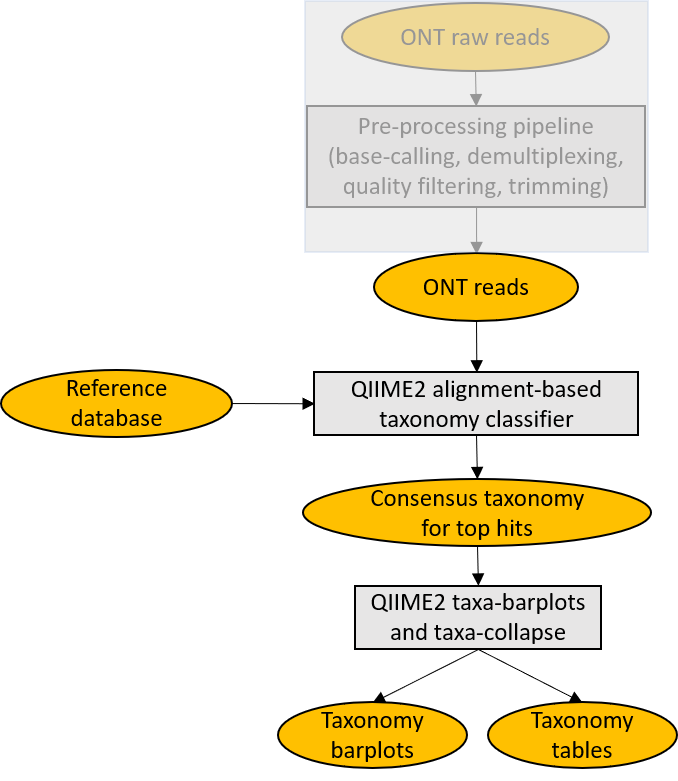
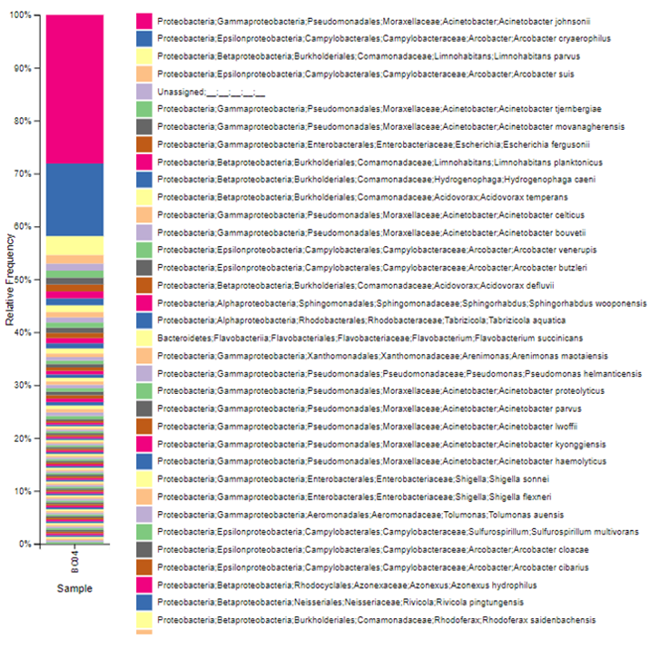

# MetONTIIME

**MetONTIIME** is a Meta-barcoding pipeline for analysing ONT data in QIIME2 framework. The whole bioinformatic workflow consists of a preprocessing pipeline and a script emulating EPI2ME 16S workflow, aligning each read against a user-defined database, so to make the whole bioinformatic analysis from raw fast5 files to taxonomy assignments straightforward and simple. Tested with Ubuntu 14.04.4 LTS. For comparison of results obtained changing the reference database and PCR primers, have a look at Stephane Plaisance's interesting [work](https://github.com/Nucleomics-VIB/InSilico_PCR).

<p align="center">
  
</p>

## Getting started

**Prerequisites**

* Miniconda3.
Tested with conda 4.8.5.
```which conda``` should return the path to the executable.
If you don't have Miniconda3 installed, you could download and install it with:
```
wget https://repo.anaconda.com/miniconda/Miniconda3-latest-Linux-x86_64.sh
chmod 755 Miniconda3-latest-Linux-x86_64.sh
./Miniconda3-latest-Linux-x86_64.sh
```

Then, after completing _MetONTIIME_ installation, set the _MINICONDA_DIR_ variable in **config_MinION_mobile_lab.R** to the full path to miniconda3 directory.

* Guppy, the software for basecalling and demultiplexing provided by ONT. Tested with Guppy v4.2.
If you don't have [Guppy](https://community.nanoporetech.com/downloads) installed, choose an appropriate version and install it.
For example, you could download and unpack the archive with:
```
wget /path/to/ont-guppy-cpu_version_of_interest.tar.gz
tar -xf ont-guppy-cpu_version_of_interest.tar.gz
```
A directory _ont-guppy-cpu_ should have been created in your current directory.
Then, after completing _MetONTIIME_ installation, set the _BASECALLER_DIR_ variable in **config_MinION_mobile_lab.R** to the full path to _ont-guppy-cpu/bin_ directory.

* A fasta file downloaded from NCBI that you want to use as a reference database, or a preformatted [marker gene reference database](https://docs.qiime2.org/2020.8/data-resources/#taxonomy-classifiers-for-use-with-q2-feature-classifier). For example, if you want to use the same database used by the EPI2ME 16S workflow for bacterial 16S gene, you can go to [BioProject 33175](https://www.ncbi.nlm.nih.gov/nuccore?term=33175%5BBioProject%5D), click _send to_, select _Complete Record_ and _File_, set the _Format_ to _FASTA_ and then click _Create File_; the database can then be imported with **Import_database.sh** script after completing installation.
In case you have downloaded a [marker gene reference database](https://docs.qiime2.org/2020.8/data-resources/#taxonomy-classifiers-for-use-with-q2-feature-classifier) instead, you already have sequence and taxonomy information in two separate text files. For example, if you want to download and import Silva_132_release database for 16S gene with sequences clustered at 99% identity, you can use the following instructions, after completing installation:
```
wget https://www.arb-silva.de/fileadmin/silva_databases/qiime/Silva_132_release.zip

unzip Silva_132_release.zip

source activate MetONTIIME_env

qiime tools import \
--type FeatureData[Sequence] \
--input-path SILVA_132_QIIME_release/rep_set/rep_set_16S_only/99/silva_132_99_16S.fna \
--output-path silva_132_99_16S_sequence.qza

qiime tools import \
--type FeatureData[Taxonomy] \
--input-path  SILVA_132_QIIME_release/taxonomy/16S_only/99/taxonomy_all_levels.txt \
--input-format HeaderlessTSVTaxonomyFormat \
--output-path silva_132_99_16S_taxonomy.qza
```

**Installation**

```
git clone https://github.com/MaestSi/MetONTIIME.git
cd MetONTIIME
chmod 755 *
./install.sh
```

A conda environment named _MetONTIIME_env_ is created, where seqtk, pycoQC, NanoFilt and qiime2-2020.8 are installed.
Then, you can open the **config_MinION_mobile_lab.R** file with a text editor and set the variables _PIPELINE_DIR_ and _MINICONDA_DIR_ to the value suggested by the installation step.

## Usage

The first time you run the _MetONTIIME_ pipeline on a new database downloaded from NCBI, you can use the **Import_database.sh** script for importing a fasta file as a pair of _QIIME2_ artifacts. This script downloads some taxonomy files from NCBI (~9.4 GB) and uses [entrez qiime](https://github.com/bakerccm/entrez_qiime) and _QIIME2_ to generate a _DNAFASTAFormat_ and a _HeaderlessTSVTaxonomyFormat_ artifacts, containing sequences and corresponding taxonomy. _Entrez_qiime_ is installed to a new conda environment named _entrez_qiime_env_.
After this step, you can open the **config_MinION_mobile_lab.R** file with a text editor and set the variables _DB_ and _TAXONOMY_ to the newly generated _QIIME2_ artifacts. Both Blast and Vsearch aligners are supported and can be selected setting _CLASSIFIER_ variable. After that, you can run the full _MetONTIIME_ pipeline using the wrapper script **Launch_MinION_mobile_lab.sh**. The script **Evaluate_diversity.sh** can be used afterwards to generate a phylogenetic tree and compute some alpha and beta diversity metrics.

**Import_database.sh**

Usage: Import_database.sh \<"sample_name".fasta\>

Input:
* \<"sample_name".fasta\>: a fasta file downloaded from NCBI containing sequences that you want to use as a reference database

Outputs:
* \<"sample_name"\_sequence.qza\>: _QIIME2_ artifact of type _DNAFASTAFormat_ containing reference sequences
* \<"sample_name"\_taxonomy.qza\>: _QIIME2_ artifact of type _HeaderlessTSVTaxonomyFormat_ containing taxonomy of reference sequences

**Launch_MinION_mobile_lab.sh**

Usage: Launch_MinION_mobile_lab.sh \<fast5_dir\>

Input:
* \<fast5_dir\>: directory containing raw fast5 files

Outputs (saved in \<fast5_dir\>\_analysis/analysis):
* feature-table_absfreq.tsv, feature-table_absfreq_level$lev.tsv: files containing the number of reads assigned to each taxa for each sample, collapsed at different taxonomic levels
* feature-table_relfreq.tsv, feature-table_relfreq_level$lev.tsv: files containing the proportion of reads assigned to each taxa for each sample, collapsed at different taxonomic levels
* taxa-bar-plots.qzv: _QIIME2_ visualization artifact of barplots with taxonomy abundances
* taxa-bar-plots-no-Unassigned.qzv: _QIIME2_ visualization artifact of barplots with taxonomy abundances excluding Unassigned reads
* demux_summary.qzv: _QIIME2_ visualization artifact with summary of sequences assigned to each sample after demultiplexing
* logfile.txt, manifest.txt, sequences.qza, table.qz*, rep-seqs.qz*, taxonomy.qz*, table_collapsed.qza, feature-table_absfreq.biom, table_collapsed_relfreq.qz*, feature-table_relfreq.biom: temporary files useful for debugging or for further analyses

Outputs (saved in \<fast5_dir\>\_analysis/qc):
* Read length distributions and pycoQC report

Outputs (saved in \<fast5_dir\>\_analysis/basecalling):
* Temporary files for basecalling

Outputs (saved in \<fast5_dir\>\_analysis/preprocessing):
* Temporary files for demultiplexing, filtering based on read length and adapters trimming

**Evaluate_diversity.sh**

Usage: Evaluate_diversity.sh -w \<working_directory\> -m \<sample_metadata\> -d \<sampling_depth\> -t \<threads\> -c \<clustering_threshold\>

Note: can be run in background with nohup; this script is experimental, suggestions for improving the logic behind it are welcome; the script subsamples the same number of reads for each sample, performs clustering at \<clustering_threshold\> threshold and considers these to be the representative sequences. It then uses representative sequences for building a phylogenetic tree and for computing some alpha and beta diversity metrics.

Inputs:

* \<working_directory\>: directory containing rep-seqs.qza and table.qza artifacts generated by _MetONTIIME.sh_ 
* \<sample_metadata\>: file containing meta-data for samples, generated by _MetONTIIME.sh_ if not provided by the user
* \<sampling_depth\>: number of reads subsampled for each sample before clustering; this value can be chosen looking at demu_summary.qzv or at logfile.txt
* \<threads\>: number of threads used for generating the phylogenetic tree
* \<clustering_threshold\>: clustering similarity threshold in (0, 1] used for picking representative sequences

Outputs:

* core-metrics-results\_\<sampling_depth\>\_subsampled: folder containing some alpha and beta diversity metrics
* alpha-rarefaction\_\<sampling_depth\>\_subsampled.qzv: visualization artifact describing alpha diversity as a function of sampling depth
* \<"sample_name"\>\_\<sampling_depth\>\_subsampled.fastq.gz, manifest\_\<sampling_depth\>\_subsampled.txt, aligned-repseqs\_\<sampling_depth\>\_subsampled.qza, masked-aligned-rep-seqs\_\<sampling_depth\>\_subsampled.qza, rooted-tree\_\<sampling_depth\>\_subsampled.qza, unrooted-tree\_\<sampling_depth\>\_subsampled.qza: temporary files generated for calculating diversity metrics

## Starting analysis from fastq.gz files

In case you have already performed basecalling, demultiplexing, quality filtering, adapters and PCR primers trimming, and already have BC\<num\>.fastq.gz files, you could run the pipeline using the following instruction:
```
source activate MetONTIIME_env
nohup ./MetONTIIME.sh <working_dir> <metadata file> <sequences qiime2 artifact> <taxonomy qiime2 artifact> <threads> <taxonomic classifier> <max accepts> <query coverage> <id thr> &
```
where:
```
<working_dir>: directory containing fastq.gz files
<metadata file>: full path to metadata file; if the file doesn't exist yet, it is created by the pipeline
<sequences qiime2 artifact>: <file name>_sequence.qza QIIME2 artifact, may be created by Import_database.sh script
<taxonomy qiime2 artifact>: <file name>_taxonomy.qza QIIME2 artifact, may be created by Import_database.sh script
<threads>: maximum number of threads used
<taxonomic classifier>: either Blast or Vsearch
<max accepts>: maximum number of hits; if a value > 1 is used, a consensus taxonomy for the top hits is retrieved 
<query coverage>: minimum of a query sequence that should be aligned to a sequence in the database [0-1]
<id thr>: minimum alignment identity threshold [0-1]
```

## Auxiliary scripts

In the following, auxiliary scripts run by **Launch_MinION_mobile_lab.sh** are listed. These scripts should not be called directly.

**MinION_mobile_lab.R**

Note: script run by _Launch_MinION_mobile_lab.sh_.

**config_MinION_mobile_lab.R**

Note: configuration script, must be modified before running _Launch_MinION_mobile_lab.sh_.

**MetONTIIME.sh**

Note: script run by **MinION_mobile_lab.R** for performing taxonomic classification in _QIIME2_ framework.

**subsample_fast5.sh**

Note: script run by _MinION_mobile_lab.R_ if _do_subsampling_flag_ variable is set to 1 in _config_MinION_mobile_lab.R_.

## Results visualization

All .qzv and .qza artifacts can be visualized either importing them to [QIIME2 View](https://view.qiime2.org/) or with command:

```
source activate MetONTIIME_env
qiime tools view <file.qz*>
```

In particular, you should get an interactive taxonomy barplot, describing the composition of each sample at the desired taxonomic level.

<p align="center">
  
</p>

## Citations

The MetONTIIME pipeline is composed of a preprocessing pipeline inherited from [ONTrack](https://github.com/MaestSi/ONTrack) and of some wrapper scripts for [QIIME2](https://qiime2.org/) and [entrez qiime](https://github.com/bakerccm/entrez_qiime). Please, refer to the following manuscripts for further information.

Bolyen E, Rideout JR, Dillon MR, Bokulich NA, Abnet CC, Al-Ghalith GA, Alexander H, Alm EJ, Arumugam M, Asnicar F, Bai Y, Bisanz JE, Bittinger K, Brejnrod A, Brislawn CJ, Brown CT, Callahan BJ, Caraballo-Rodríguez AM, Chase J, Cope EK, Da Silva R, Diener C, Dorrestein PC, Douglas GM, Durall DM, Duvallet C, Edwardson CF, Ernst M, Estaki M, Fouquier J, Gauglitz JM, Gibbons SM, Gibson DL, Gonzalez A, Gorlick K, Guo J, Hillmann B, Holmes S, Holste H, Huttenhower C, Huttley GA, Janssen S, Jarmusch AK, Jiang L, Kaehler BD, Kang KB, Keefe CR, Keim P, Kelley ST, Knights D, Koester I, Kosciolek T, Kreps J, Langille MGI, Lee J, Ley R, Liu YX, Loftfield E, Lozupone C, Maher M, Marotz C, Martin BD, McDonald D, McIver LJ, Melnik AV, Metcalf JL, Morgan SC, Morton JT, Naimey AT, Navas-Molina JA, Nothias LF, Orchanian SB, Pearson T, Peoples SL, Petras D, Preuss ML, Pruesse E, Rasmussen LB, Rivers A, Robeson MS, Rosenthal P, Segata N, Shaffer M, Shiffer A, Sinha R, Song SJ, Spear JR, Swafford AD, Thompson LR, Torres PJ, Trinh P, Tripathi A, Turnbaugh PJ, Ul-Hasan S, van der Hooft JJJ, Vargas F, Vázquez-Baeza Y, Vogtmann E, von Hippel M, Walters W, Wan Y, Wang M, Warren J, Weber KC, Williamson CHD, Willis AD, Xu ZZ, Zaneveld JR, Zhang Y, Zhu Q, Knight R, and Caporaso JG. 2019. Reproducible, interactive, scalable and extensible microbiome data science using QIIME 2. Nature Biotechnology 37: 852–857. https://doi.org/10.1038/s41587-019-0209-9

Baker CCM (2016). entrez qiime: a utility for generating QIIME input files from the NCBI databases.
github.com/bakerccm/entrez qiime, release v2.0, 7 October 2016. doi:10.5281/zenodo.159607

Maestri S, Cosentino E, Paterno M, Freitag H, Garces JM, Marcolungo L, Alfano M, Njunjić I, Schilthuizen M, Slik F, Menegon M, Rossato M, Delledonne M. A Rapid and Accurate MinION-Based Workflow for Tracking Species Biodiversity in the Field. Genes. 2019; 10(6):468. https://doi.org/10.3390/genes10060468
